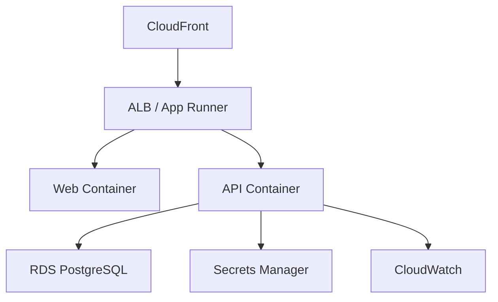

# Design AWS Architecture

## この skill を使う場面

- 新規プロジェクトの AWS アーキテクチャを設計する場合
- オンプレ / ローカルからAWS への移行を計画する場合
- 既存 AWS 構成を見直す場合

## 入力前提

- solution-architect が定義した全体アーキテクチャ
- 非機能要件（可用性、スケーラビリティ、コスト）
- コンテナイメージが ECR にプッシュ可能であること

## 実行手順

### Step 1: コンピュート選定

| 基準 | App Runner | ECS/Fargate |
|---|---|---|
| 運用 complexity | 低い | 中 |
| 自動スケーリング | 組み込み | 設定必要 |
| カスタマイズ性 | 低 | 高 |
| コスト（小規模） | 安い | やや高い |
| VPC 統合 | オプション | 標準 |
| 推奨 | スタートアップ、MVP | 本格運用、エンタープライズ |

### Step 2: ネットワーク設計

- VPC: 2 AZ、パブリック + プライベートサブネット
- RDS: プライベートサブネットに配置
- App Runner / ECS: パブリックサブネット（ALB 経由）

### Step 3: データベース設計

- RDS PostgreSQL (db.t3.micro for dev / db.t3.small for prod)
- Multi-AZ: 本番のみ有効化
- 自動バックアップ: 7 日保持

### Step 4: セキュリティ設計

- IAM ロール: 最小権限の原則
- Secrets Manager: DB URL、JWT Secret、LLM API キー
- SSL/TLS: 全通信を暗号化
- セキュリティグループ: 必要なポートのみ開放

### Step 5: 監視設計

- CloudWatch Logs: アプリケーションログ
- CloudWatch Metrics: CPU、メモリ、リクエスト数
- CloudWatch Alarms: エラー率、レイテンシ
- X-Ray: 分散トレーシング（オプション）

### Step 6: コスト見積もり

各サービスの月額コストを概算で見積もる。

## 判断ルール

- MVP / スタートアップ → App Runner
- エンタープライズ / 高カスタマイズ → ECS/Fargate
- DB は常に RDS PostgreSQL（Prisma との相性）
- CDN は CloudFront を推奨

## 出力形式

AWS アーキテクチャ図（Mermaid）、サービス構成表、コスト見積もり。

## 注意点

- 過度に複雑な構成にしない（スターターリポジトリとして）
- コスト最適化を常に意識する
- IAM ロールはワイルドカードを避ける

## 失敗時の扱い

- 要件が不明確: solution-architect に非機能要件を確認する
- コスト超過の懸念: Fargate Spot、Reserved Instance を検討する
