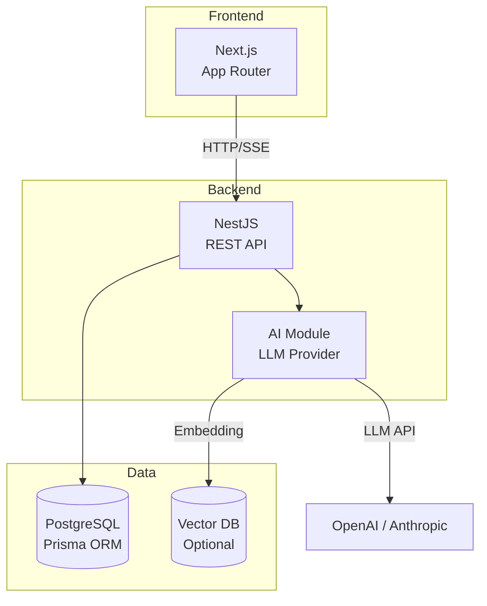

# アーキテクチャ概要

## システム構成

## レイヤー構成

| レイヤー | 技術 | 責務 |
|---|---|---|
| Presentation | Next.js (App Router) | UI レンダリング、ルーティング、フォーム |
| API | NestJS | ビジネスロジック、認証、バリデーション |
| AI | LLM Provider Pattern | LLM 統合、プロンプト管理、ストリーミング |
| Data | Prisma + PostgreSQL | データ永続化、マイグレーション |
| RAG (Optional) | Embedding + Vector DB | ナレッジ検索、コンテキスト拡張 |

## モノレポ構成

- `apps/web`: Next.js フロントエンド
- `apps/api`: NestJS バックエンド
- `packages/shared`: 共通型定義・ユーティリティ

## 設計原則

1. **責務分離**: フロントエンド / バックエンド / AI の境界を明確にする
2. **Provider パターン**: LLM プロバイダーを交換可能にする
3. **TDD**: 全機能は Red → Green → Refactor で開発する
4. **Docker First**: ローカル開発は Docker Compose を使用する
5. **コンテナベースデプロイ**: 本番も開発もコンテナイメージを共通基盤にする
