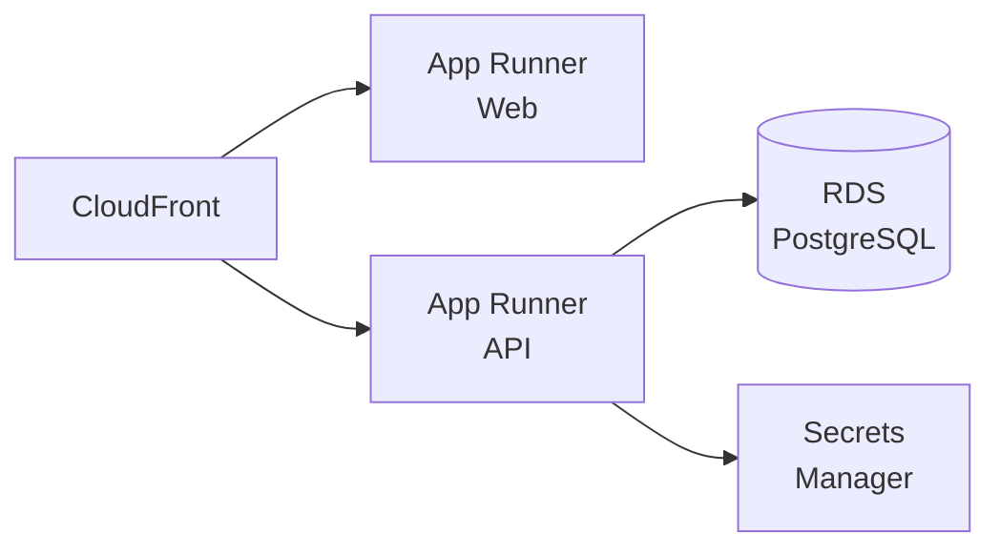
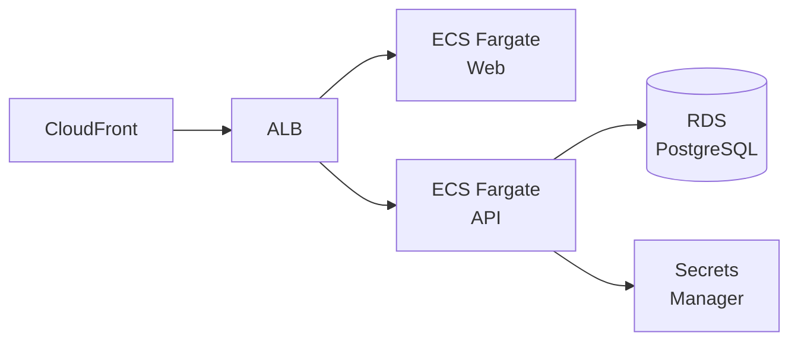

# AWS デプロイガイド

## 推奨構成

### シンプル構成（App Runner）

- 運用が簡単、自動スケーリング内蔵
- スタートアップ / MVP に最適

### スケーラブル構成（ECS/Fargate）

- 細かいスケーリング制御
- エンタープライズ / 本格運用に最適

## デプロイ手順

1. CloudFormation でインフラ構築: `infra/aws/cloudformation/infrastructure.yml`
2. Secrets Manager にシークレット登録
3. ECR にイメージプッシュ
4. App Runner / ECS サービス作成
5. DB マイグレーション実行
6. ヘルスチェック確認

## CI/CD

GitHub Actions によるOIDC 認証 + 自動デプロイ:
- `.github/workflows/ci.yml`: テスト・ビルド
- `.github/workflows/deploy.yml`: ECR プッシュ + デプロイ

## コスト目安（月額）

| サービス | 見積もり |
|---|---|
| App Runner (2 service) | ~$30-60 |
| RDS (db.t3.micro) | ~$15-20 |
| ECR | ~$1-5 |
| Secrets Manager | ~$1 |
| CloudWatch | ~$5 |
| **合計** | **~$50-90** |
